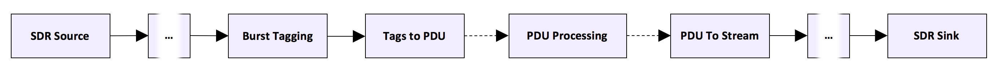
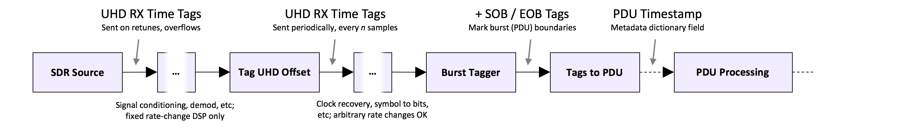

## GNU Radio PDU Utilities

This GNU Radio module contains tools for manipulation of PDU objects. There are blocks to translate between streams and PDUs while maintaining timing information, a number of self-explanatory blocks that emulate the behavior of some in-tree stream blocks for messages and PDUs, and some other features. This module is complimentary to the gr-timing_utils module and some of the advanced timing features require blocks there.

All blocks are written in C++, and make use of the GR_LOG API, there is no stdout output; there is minimal PMT symbol interning at runtime, and blocks should be thread safe. QA code exists for most blocks, and when bugs are fixed QA is updated to catch the errors. The general concept of this module, and usage for some of the more unique blocks are described in this document.

---

### General Concept of PDU Conversion with the PDU Utils Module

The general concept of PDU conversion using this module is shown below:

The start and end of a burst is tagged via some means (see below) and the _Tags to PDU_ block will emit a PDU with the PMT vector as the data between the tags. Some basic metadata is provided, and advanced options exist for timing reasons. Once turned into a PDU, the data can be processed, and if desired the data can be turned back into a stream with _tx\_sob_ and _tx\_eob_ tags for transmission with a UHD-style sink.

Advanced timing modes for RX are included that allow for coarse timing (+/- a couple symbols) which is sufficient for most communications applications. This timing is not intended for precision timing, rather as an option for relatively good timing through rate changes without too much overhead. This is particularly well suited for low-order digital signals; however, the general concept can be used for displaying all sorts of data. If End-of-burst cannot be practically tagged, it is possible to configure the _Tags to PDU_ block to emit a fixed-length PDU and downstream processing can handle the fine details.

UHD-style receive time tags are emitted by the source and recorded by the _Tag UHD Offset_ block which will periodically emit updated UHD-style time tags. The rate at which these are emitted is controllable; which is necessary if any arbitrary-rate-change blocks are present between the source and the _Tags to PDU_ block. Burst tagging works as in the basic mode, and the _Tags to PDU_ block will automatically use the UHD-style time tags to determine burst time. It is important that blocks propagate tags correctly through rate changes. Clock recovery is a step for which this can be complicated; the new (as of 3.7.11) _Symbol Sync_ block is a good option for CR as it propagates tags correctly when the output SPS is set to 1.

Timed transmission is also supported via UHD-style _tx\_sob_ and _tx\_eob_ tags as shown below.

When the metadata dictionary key _tx\_time_ is provided with UHD-style tuple of {uint64 seconds, double fractional seconds}, this value will be added to a _tx\_time_ tag on the _tx\_sob_ sample. This allows for timed transmission with UHD-style transmit blocks.

#### Burst Tagging Methods

There are several ways to tag bursts that work well with this type of data. To identify Start-of-Burst, a very simple way is to do a basic energy detection threshold and tag according to energy level, however this is not very robust. Another straightforward method is to run an open-loop demodulator and use a _Correlate Access Code - Tag_ block to detect the preamble and start of unique word to delineate and tag SOBs. Alternately, a correlation-based method can be used if this is already implemented for preamble detection.

End of Burst tagging can be a little trickier as there are several ways RF protocols indicate end-of-burst. Generally, the best way is to write a custom block that detects SOB tags, parses the RF header for length information, and automatically tags EOB's accordingly. Sometimes RF protocols will specify a detectable EOB sequence which can be detected with a second _Correlate Access Code - Tag_ block directly. For fixed length bursts an EOB is not necessary and the block can be configured by the maximum length parameter to effectively set the EOB.

### Usage of Significant blocks

The usage of several significant blocks are described in this section. Many blocks are omitted as their behavior is straightforward or documented in the GRC XML sufficiently.

##### ___GR PDU Utils - Tags to PDU Block___

__Basic Usage:__ The _Tags to PDU_ block accepts a stream input and produces a PDU output. The start of a PDU is indicated by a configurable GR stream tag (only the Key matters), and the end of a PDU can be defined by a configurable tag, or by a configurable maximum length; when the maximum length is reached, the PDU will be emitted. If a second start-of-burst tags is received prior to an end-of-burst tag or the maximum length being reached, the block will discard data from the first tag and reset the internal state starting with the latest start-of-burst tag. The block also accepts a _Prepend_ vector argument, which allows for data elements to be included at the start of each PDU. This is useful for byte alignment, or when correlating against a complete or partial Unique Word, and it is desirable to have the complete UW represented in the output. The elements in this vector count toward the _Max PDU Size_ parameter.

__Optional Burst Identification Parameters:__ The _Tags to PDU_ block can be configured to only accept EOB tags in discrete relationships to the SOB tag position through the _EOB Alignment_ and _EOB Offset_ parameters. This will ensure that valid EOB tags are only at _n_ * _EOB Alignment_ item indexes, and the  _EOB Offset_ can be used to slew that value if the SOB tag is not suitably located. Additionally, an _Tail Size_ can be specified and that number of items after the EOB tag will be included in the PDU if allowable.

__Advanced Timing Features:__ As described above, this block can be used with UHD-style time tags to provide a reasonably accurate burst timestamp (within a few symbols / bits) with relatively minimum overhead. The key for these tags can be modified but is normally _rx\_time_ and the data consist of a two element tuple of uint64 seconds followed by double fractional seconds in range [0, 1). This timing works by knowing the sample rate of the block and keeping track of the last known time-tagged sample and it's offset. Time is then propagated forward assuming the sample rate is exactly precise. As this can drift over time for a variety of reasons, it may be desirable to time-tag samples periodically upstream (e.g.: on burst detections) to improve accuracy and address clock drift, variable block ratios, or dropped samples; the _Tag UHD Offset_ block from the gr-timing_utils module can be used to assist with this. The block also supports the ability to generate boost timestamps in seconds from unix epoch format. This is helpful for debugging but generally less accurate and may carry a greater processing penalty.

__Detection Emissions:__ The block can be configured to emit a message every time a SOB tag is detected. This is useful when a low-latency reaction is necessary to incoming data, though it must be used with caution as it is prone to false detections. The emission is simply a uint64 PMT containing the offset of the received SOB tag.

##### ___GR PDU Utils - PDU to Bursts Block___

__Basic Usage:__ The _PDU to Bursts_ block accepts PDUs of user-specified type and emits them as streaming data. The original intent of this block was to allow USRP based transmission of data originating from PDU-based processing from data converted to PDUs by the _Tags to PDU_ block for half-duplex transceiver applications. As such, the block will automatically append _tx\_sob_ and _tx\_eob_ tags around streaming output data to indicate the start and end of valid data to the SDR. The block is simple to use; configuration is limited to type and behavior when new PDUs are received while the data from a current PDU is still being emitted. The data can either be appended to the current burst, dropped, or the block can throw an error ('Balk'). The latter two modes were implemented for very specific cases and generally 'Append' mode is the best choice. The number of PDUs that can queue up waiting for transmission is also configurable to bound memory usage (though the individual PDUs can be large).

__Timed Transmissions:__ The _PDU to Bursts_ block also supports UHD-style timed transmissions. If a PDU metadata dictionary key _tx\_time_ exists, and the value is a properly formatted UHD time tuple, a _tx\_time_ tag will be added along with the _tx\_sob_ tag to the first item in the PDU, which will be recognized as a timed transmission by downstream blocks. Late bursts will be handled according to the behavior of the downstream processing elements, and may be dropped, sent immediately, or potentially errors caused. It is also necessary to be careful with setting timestamps too far in the future as this can result in issues due to backpressure in the DSP chain.

##### ___GR PDU Utils - Tag Message Trigger Block___

__Overview:__ The _Tag Message Trigger_ block emits PDUs based on certain input conditions observed on either stream or message inputs and supports operating with or without an arming step prior to triggering. This block is more complicated and powerful that it looks, though it has utility in many straightforward applications also. The initial intention of this block was to allow for a stream tag to emit a PDU immediately. This has been expanded upon to support several additional modes of operation which are described here.

__Basic Tag Based Message Emission:__ The most basic mode of this block looks for a tag and emits a message (can be a PDU but does not have to) when it is identified. This was expanded on to allow the concept of a separate 'arming' tag, and an internal armed/disarmed state; the block will only emit a message when armed. If the arming key is set to _PMT\_NIL_, the block is always armed and operates in the simple mode of emitting a message when a key is seen.

__Usage of the Arming and Re-trigger Holdoff:__ The arming status can also be set to automatically disarm after a certain number of samples which is the _Holdoff_ parameter. An internal counter will track samples from the arming event, and a trigger event that occurs after the arming offset + _holdoff_ will have the same behavior as a trigger event when the block is disarmed. The holdoff value will also set the shortest interval for which the triggering action can happen, even when the block is set to always be armed. A second trigger event that is less than _holdoff_ samples from the previous trigger event will be treated as though the block is disarmed. If the holdoff parameter is set to zero it will have no effect.

__Timed PDU Mode:__ The _Tag Message Trigger_ block can operate in two fundamental message modes. In 'Message' mode, the block will emit whatever PMT it has been configured to directly. The alternative, 'Timed PDU' mode allows for the block to add a _tx\_time_ metadata dictionary value that is a user definable amount of time in the future. The block will automatically track time of samples in the same way the _Tags to PDU_ block does, and the _tx\_time_ key will be a UHD time tuple _Delay Time_ seconds from when the trigger tag was received. This is useful for automatically transmitting a known signal whenever a qualified trigger event is detected.

__Transmission Limit:__ A final feature that is not exposed to the GRC is the concept of transmission limits. This value can be updated by callback, and if it is not set to _TX\_UNLIMITED_ it will be decremented each time the block triggers. When it reaches zero, trigger events will be treated as though the block is disarmed.

##### ___GR PDU Utils - PDU Pack Unpack Block___

__Usage:__ The _PDU Pack Unpack_ block is primarily used to convert between U8 PDUs representing one bit per element, and U8 PDUs representing 8 bits per element. The block can also convert bit order for packed U8 data. The usage is straightforward, specify pack/unpack/reverse and declare the bit order, however it is included in this section due to the usefulness.

This block could also be extended to support other options (higher order modulation packing, conversion to U16, etc) if necessary but a use case as not yet been identified. If this happens appropriate test code should be added to exercise such conditions.

##### ___GR PDU Utils - PDU Add Noise Block___

__Usage:__ This block can be used to add uniform random values to an input array of uint8, float, or complex data; other PDU types will be dropped with a WARNING level GR_LOG message. This is fairly straightforward; however, it is included here as the block also the non-obvious capability to scale and offset the input data PDU as well. This is done through the following logic:

`out[ii] = (input[ii] + ((d_rng.ran1()*2 - 1) * d_noise_level)) * d_scale + d_offset;`

Which is to say that the order of operations is to apply the random data first, then scale the data, then offset it. Generally useful for debugging and testing, and as such it has not seen extensive use so there may be some issues. Noise profiles are not supported, only uniform random data from the ran1() function within gr::random. It could be argued that these should be separate blocks entirely, but to reduce the overhead of PMT-ifying and de-PMT-ifying data it was implemented this way to allow all three operations to be done at once. Maybe the name should be changed...

##### ___GR PDU Utils - PDU Clock Recovery___

__Summary:__ This block performs clock synchronization and symbol recovery on 2-ary modulated data using algorithms from M. Ossmann’s WPCR project. The block accepts soft and unsynchronized data and uses a zero-crossing detector to effectively recover data sampled between 4 and 60 samples per symbol, though it does perform better below 16 samples per symbol. Compared to in-tree options, this block has several advantages, primarily that it operates on PDU formatted data enabling it to work within the Message Passing API. Because the block operates on PDU data, it can make use of the entire packet to aid in data synchronization improving sensitivity. Additionally, the block does not require precise configuration or tuning which results in reduced user-error and increased capability when processing signals for which exact parameters are unknown.

##### ___GR PDU Utils - PDU FIR Filter___

__Summary:__ This block is a direct analog to the in-tree Decimating FIR streaming filter. It makes use of the same underlying filterNdec function in the from the _fir\_filter\_xxf_ kernel from gr::filter. The use of this block has uncovered several invalid operations due to the pointer logic used which do not manifest themselves when used with the streaming API but are a problem with the filter kernels in general. Upstream issues have been filed and workarounds built into the blocks.

These blocks do not use FFT based filters as the FFT kernels are not yet templatized. This may be added as an option to this block in the future as the FFT implementation of discrete filters is more efficient for large numbers of taps

##### ___GR PDU Utils - PDU PFB Arbitrary Resampler___

__Summary:__ This block is a direct analog to the in-tree PFB Arbitrary Resampler streaming block. It makes use of the same _pfb\_arb\_resampler\_ccf_ kernel from gr::filter. This block will reject non-PDU type data, and currently only works on c32 type PDUs; taps must be real valued.

##### ___GR PDU Utils - PDU Flow Controller___

__Summary:__ The GNU Radio Asynchronous Message Passing API has no concept of flow control or backpressure. A slow block in the processing chain will cause an unbounded backup of messages which can in turn result in software failures as messages are never dropped, and the publish method does not block.

This block will check the message queue size for subscribed blocks, and it will drop messages over a configurable maximum queue size. Dropping data is not always preferred, so this should only be used in situations where data loss is acceptable.
